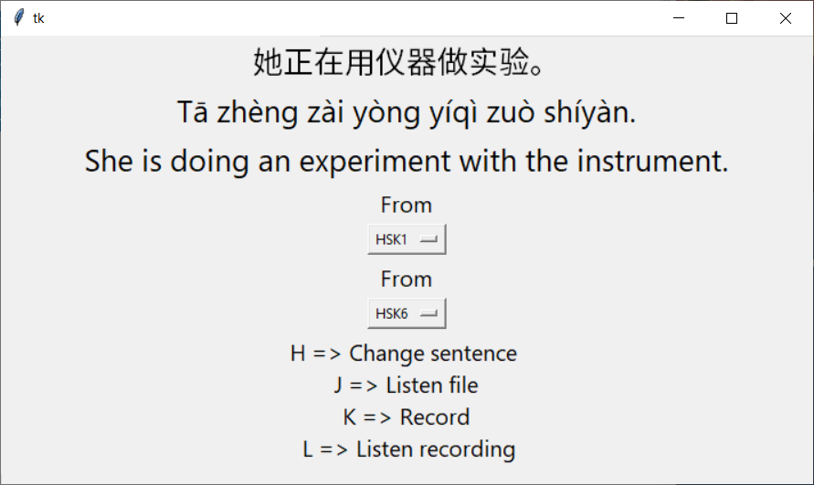

# chinese-shadowing
 
Simple APP for shadowing chinese. With this application, it is very easy to record
yourself, play the sound recorded and listen to some chinese sentences.

## How to use

After the installation, execute in the console:
```bash
chinese-shadowing
```

This application works with keybord hotkeys:  
`H` => Change sentence   
`J` => Listen file  
`K` => Record (start when key is pressed, stop when key is released)   
`L` => Listen recording  

## Installation
```python
pip install git+https://github.com/thomashirtz/chinese-shadowing#egg=chinese-shadowing
```

## Data

The data comes from the Reddit post Anki deck ["Best Anki Deck for HSK I've come across"](https://www.reddit.com/r/ChineseLanguage/comments/7mjmjc/best_anki_deck_for_hsk_ive_come_across/).
